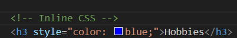
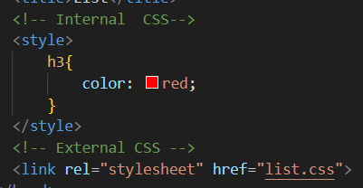
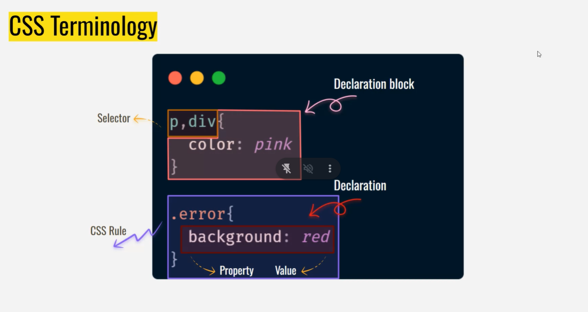

## What is CSS?
Cascading Style Sheets
- Giving skin to your skeleton page

## Types of CSS
1. Inline CSS

2. Internal CSS  
Preferred for initial load of the html page  
Keep it short and sweet
3. External CSS  
Preferred for reusability and separation  

## CSS Terminology

## CSS Stylings
### Text Styling - I  
1. font-size
2. font-weight
3. font-style //Italic,underline
4. color
    - Color Name
    - RGB (x,y,z) Where x,y,z ∈ 0 to 255
    - Using Styles tab in inspect
    - HEX representation
    - rgba() a ∈ 0 to 1 which is responsible for opacity
    - hsl(hue(color), saturation, lightness)
    - lch ()
### Text Styling - II
1. text-transform - Case changing
2. text-align - left,right
3. text-decoration - underline,link
4. letter-spacing
5. line-height
